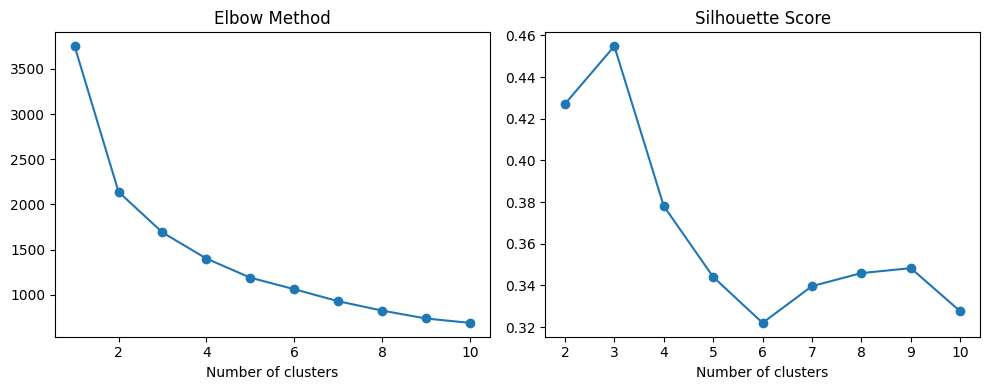

# Laporan Proyek Machine Learning - Lutfi Kurrotaeni

## Pendidikan

Penilaian prestasi akademik siswa merupakan salah satu indikator capaian belajar. Prestasi akademik tidak hanya dipengaruhi oleh faktor kognitif, 
tetapi juga dipengaruhi oleh berbagai aspek seperti lingkungan, sosial, dan psikologis. Oleh karena itu, analisis yang komperhensif untuk memahami berbagai
faktor yang memengaruhi prestasi akademik dapat memberikan wawasan yang berharga untuk meningkatkan proses belajar mengajar.

Memahami faktor-faktor yang memengaruhi nilai ujian siswa dapat membantu sekolah, guru, dan pihak terkait dalam merancang kebijakan atau intervensi yang lebih 
sesuai dengan kebutuhan setiap siswa. Hal ini juga memungkinkan penyesuaian dukungan yang lebih tepat, baik dari segi sumber daya, pendekatan pembelajaran, maupun 
keterlibatan orang tua. Banyak siswa mungkin mengalami kesulitan mencapai potensi akademik terbaiknya bukan karena kekurangan kemampuan, melainkan karena kurangnya 
dukungan atau akses yang memadai terhadap sumber daya yang mendukung proses belajar mereka.

Menurut [Adamu dkk.](https://goodwoodpub.com/index.php/jshe/article/view/1735), prestasi akademik siswa dipengaruhi oleh faktor psikologis, ekonomi, sosial, pribadi, dan lingkungan.
Selain itu, faktor-faktor yang berpengaruh terhadap prestasi akademik siswa berbeda dari satu negara dengan negara lainnya, dari budaya satu dengan budaya lainnya, bahkan dari satu orang ke orang lainnya.  
[Afandi dkk.](https://e-journals.dinamika.ac.id/joti/article/view/514/412) dalam penelitiannya menggunakan beberapa faktor yang memengaruhi prestasi akademik. Faktor-faktor tersebut diantaranya adalah
jenis kelamin, usia, pendidikan orang tua, kota asal, kesulitan belajar, dan lingkungan.

Data yang digunakan untuk analisis berasal dari [kaggle](https://www.kaggle.com/datasets/lainguyn123/student-performance-factors). Data ini merupakan data sintesis, jadi bukan data asli hasil pengumpulan creator dari dunia nyata.

## Business Understanding

Berdasarkan latar bekalang yang telah dikemukakan, berikut ini terdapat klarifikasi masalah yang akan diselesaikan.  
Bagian laporan ini mencakup: 

### Problem Statements

Menjelaskan pernyataan masalah latar belakang:
- Bagaimana faktor motivasi siswa memengaruhi prestasi akademik siswa?
- Bagaimana pengaruh orang tua terhadap prestasi akademik siswa?
- Bagaimana berbagai faktor internal, keluarga, dan sosial digunakan untuk memprediksi prestasi belajar siswa?
- Bagaimana pengelompokkan siswa berdasarkan faktor-faktor internal dari seorang siswa?

### Goals

Menjelaskan tujuan dari pernyataan masalah:
- Mengidentifikasi pengaruh motivasi terhadap prestasi akademik siswa.
- Mengetahui pengaruh orang tua terhadap prestasi akademik siswa.
- Membangun model regresi untuk memprediksi nilai ujian siswa dari berbagai faktor.
- Melakukan segmentasi siswa berdasarkan faktor internal pada diri siswa.

### Solution Statements

Uraian cara untuk meraih goals:
- Melakukan eksplorasi data untuk memahami distribusi dan korelasi antar-faktor yang memengaruhi prestasi akademik siswa.
- Menerapkan beberapa model regresi untuk memprediksi nilai ujian siswa berdasarkan berbagai fitur. Performa model diukur menggunakan metrik MAE, RMSE, dan R².
- Melakukan pengelompokkan siswa menggunakan model K-Means berdasarkan faktor internal siswa.

## Data Understanding
Dataset memiliki 20 fitur dengan total 6607 data. Kolom `Teacher_Quality` `Parental_Education_Level`, dan `Distance_from_Home` memiliki beberapa nilai kosong, sementara kolom lainnya tidak ada nilai kosong.
Dataset tidak memiliki data duplikat dengan 13 kolom bertipe object dan 7 kolom bertipe numerik.

Variabel-variabel pada Student Performence Factors dataset adalah sebagai berikut:
- Hours_Studied: Waktu yang dihabiskan untuk belajar per minggu.
- Attendance: Persentase kehadiran.
- Parental_Involvement: Tingkat keterlibatan orang tua dalam pendidikan siswa (Low, Medium, High).
- Access_to_Resources: Ketersediaan sumber belajar (Low, Medium, High).
- Extracurricular_Activities: Berpartisipasi dalam kegiatan ekstrakurikuler (Yes, No).
- Sleep_Hours: Rata-rata jumlah jam tidur per malam.
- Previous_Scores: Niali ujian sebelumnya.
- Motivation_Level: Tingkat motivasi siswa (Low, Medium, High)
- Internet_Access: Ketersediaan akses internet (Yes, No).
- Tutoring_Sessions: Jumlah sesi bimbingan yang dihadiri per bulan.
- Family_Income: Tingkat pendapatan keluarga (Low, Medium, High).
- Teacher_Quality: Kualitas pengajar (Low, Medium, High).
- School_Type: Tipe sekolah yang diambil (Public, Private).
- Peer_Influence: Pengaruh temang sebaya terhadap prestasi akademik (Positive, Neutral, Negative).
- Physical_Activity: Rata-rata jumlah jam kegiatan fisik per minggu.
- Learning_Disabilities: Adanya kesulitan belajar (Yes, No).
- Parental_Education_Level: Tingkat pendidikan terakhir orang tua (High School, College, Postgraduate).
- Distance_from_Home: Jarak antara rumah dan sekolah (Near, Moderate, Far).
- Gender: Jenis kelamin siswa (Male, Female).
- Exam_Score: Nilai ujian akhir.

### Eksplorasi Data

- Sebagian besar data berdistribusi normal. Namun, variable Attendance dan Previous_Scores berdistribusi uniform.
- Perbandingan ssiwa yang memiliki akses internet dan yang tidak memiliki sangat jauh berbeda. Begitupun siswa yang tidak memiliki hambatan belajar berbeda jauh dengan siswa yang memiliki hambatan belajar.
- Pendapatan keluarga siswa memiliki distribusi yang sama antara medium dan low, sedangkan pendapatan high paling sedikit.

- Siswa dengan tingkat motivasi rendah atau sedang lebih banyak mencapai nilai ujian tinggi (>90) dibanding siswa dengan tingkat motivasi tinggi.
- Siswa yang tidak memiliki kesulitan belajar memperoleh nilai ujian lebih tinggi secara keseluruhan dibanding siswa yang memiliki kesulitan belajar.
- Tidak terlihat perbedaan signifikan antara nilai ujian siswa berdasarkan gender.

- Siswa dengan akses sedang atau rendah pada sumber belajar lebih banyak memperoleh nilai ujian yang baik dibanding siswa dengan akses rendah. Artinya, siswa yang memiliki akses lebih baik terhadap sumber daya cenderung memiliki peluang lebih tinggi untuk mencapai nilai maksimal.
- Siswa yang mengikuti kegiatan ekstrakurikuler cenderung memperoleh nilai ujian yang lebih baik dibanding siswa yang tidak mengikuti kegiatan ekstrakurikuler.
- Akses internet memberikan kontribusi untuk membantu siswa memperoleh nilai yang lebih tinggi.

- Siswa dengan keterlibatan orang tua yang rendah cenderung memperoleh nilai tinggi lebih sedikit dibanding siswa dengan keterlibatan orang tua yang sedang atau tinggi. Hal tersebut menunjukkan pentingnya keterlibatan orang tua dalam proses belajar siswa.
- Sama seperti keterlibatan orang tua, siswa dari keluarga berpendapatan sedang atau tinggi cenderung lebih sering mendapatkan nilai ujian yang tinggi.

- Meskipun siswa dengan orang tua yang memiliki tingkat pendidikan Postgraduate memperoleh nilai tinggi lebih sedikit, tetapi nilai median yang diperoleh lebih tinggi dibanding tingkat pendidikan lainnya.
- Siswa yang terpengaruh negatif oleh teman sebaya cenderung cenderung lebih sulit untuk memperoleh nilai tinggi. Selain itu juga terlihat bahwa median nilai ujiannya lebih rendah dibanding perngaruh netral atau positif dari teman sebaya.
- Sama seperti pada pengaruh teman sebaya, siswa degan jarak dari rumah ke sekolah yang jauh lebih sulit untuk memperoleh nilai tinggi. Terlihat juga bahwa median nilai ujiannya lebih rendah dibanding siswa dengan jarak dari rumah yang dekat atau sedang.
- Kualitas guru juga sangat berpengaruh terhadap nilai ujian yang dicapai siswa. Siswa dengan guru yang berkualitas rendah lebih sedikit yang memperoleh nilai tinggi.
- Tipe sekolah publik maupun privat tidak memberikan perbedaan signifikan terhadap nilai ujian siswa.
  
## Data Preparation
Sebelum data dianalisa dan digunakan untuk pemodelan machine learning, dilakukan beberapa tahap persiapan data. Berikut ini adalah tahap yang dilakukan:
1. Mengisi data hilang.
   - Pada data kategorik 'Teacher_Quality', 'Parental_Education_Level', dan 'Distance_from_Home' terdapat beberapa nilai kosong. Karena data tersebut bertipe kategorik, maka teknik pengisiannya menggunakan nilai modus.
   - Tidak ada nilai kosong pada data dengan tipe numerik.
2. Menggati data yang tidak sesuai.
   - Terdapat nilai Exam_Score yang melebihi 100, sehingga data tersebut diubah menjadi nilai 100.
3. Feature encoding
   - Data kategorik akan diubah menjadi nilai numerik dengan dua cara yang berbeda. Untuk data ordinal, data diubah dengan teknik mapping berdasarkan tingkatannya, sedangkan data lainnya menggunakan `LabelEncoder` dari scikit-learn.
4. Split data
   - Untuk membuat model regresi, data dibagi menjadi data latih dan data uji, sedangkan untuk model clustering tidak dilakukan split dataset.
5. Normalisasi data
   - Supaya model lebih mudah untuk melakukan prediksi, data dinormalisasi menggunakan teknik `MinMaxScaler` dari scikit-learn. Teknik ini mengubah skala yang berbeda-beda pada setiap fitur menjadi skala yang sama, yaitu 0 sampai 1.

## Modeling
Tahapan ini membahas mengenai model machine learning yang digunakan untuk menyelesaikan permasalahan. Model machine learning pada data ini untuk melakukan regresi dan klasterisasi.

1. Regresi  
   Model regresi menggunakan beberapa algoritma yang berbeda. Hal tersebut dilakukan untuk mendapatkan variasi algoritma yang sesuai dengan data. Algoritma pertama yang digunakan adalah **Linear Regresi** karena algoritma ini sederhana dan mudah diimplementasikan.
   Selain itu algoritma ini juga mudah untuk diinterpretasikan. Namun, algoritma ini akan memiliki performa buruk apabila hubungan antara fitur dan targetnya tidak linear. Data outlier juga akan berpengaruh kepada performa karena dapat menyebabkan bias pada hasil prediksi.

   Selain untuk menyelesaikan masalah klasifikasi, Decision tree juga bisa digunakan untuk regresi. Algoritma ini mudah dipahami dan diinterpretasikan karena algoritma ini menyerupai cara manusia mengambil keputusan. Algoritma ini juga dapat menangkap hubungan non-linear dalam data
   serta mampu bekerja pada tipe data campuran. Namun, algoritma ini seringkali menyebabkan overfitting karena mempelajari data terlalu dalam.

   Algoritma lain yang dapat digunakan pada masalah klasifikasi dan regresi yaitu Gradient boosting. Algoritma ini dapat membangun model yang dapat memperbaiki kesalahan dari model sebelumnya, sehingga dapat menangani data kompleks. Namun, algoritma ini rentan terhadap overfitting 
   jika tidak dilakukan tuning parameter yang baik.

   Dari ketiga algoritma tersebut, dipilih satu algoritma dengan nilai evaluasi terbaik. Algoritma yang dipilih yaitu Linear Regression.

2. Klasterisasi  
   Pada masalah klasterisasi, digunakan algoritma k-means. Algoritma ini cukup sederhana dan mudah diimplementasikan. Algoritma ini juga mudah diinterpretasikan secara intuitif karena setiap datanya dikelompokkan berdasarkan kedekatannya dengan pusat cluster.
   Namun, algoritma ini perlu menentukan jumlah klaster sebelum model dijalankan. Hal tersebut akan memerlukan eksperimen untuk medapatkan jumlah klaster yang optimal. Algoritma ini juga sangat sensitif terhadap outlier karena outlier dapat menggeser centroid dan membuat hasil clustering 
   tidak representatif.

   Untuk menangani kekurangan algoritma k-menas, beberapa improvisasi dilakukan. Salah satunya adalah menginisiasi model menggunakan k-means++ dan melakukan pemilihan jumlah klaster berdasarkan hasil evaluasi menggunakan elbow method dan silhouette score.

## Evaluation
Beberapa metrik evaluasi pada model regresi yang digunakan adalah RMSE, MAE, dan R², sedangkan untuk evaluasi model clustering menggunakan elbow method dan silhouette score.

1. Mean Absolute Error (MAE)  
   MAE adalah rata-rata dari nilai mutlak kesalahan prediksi (perbedaan antara niai sebenarnya dengan prediksi). Metrik ini menunjukkan seberapa besar kesalahan rata-rata model tanpa memperhitungkan arah kesalahan. Rumus dari MAE adalah:  
   $\text{MAE} = \frac{1}{n} \sum_{i=1}^{n} |y_i - \hat{y}_i|$  
   Keterangan:  
   - $y_i$: nilai sebenarnya
   - $\hat{y}_i$: nilai prediksi
   - $n$: jumlah data

2. Root Mean Square Error (RMSE)  
   RMSE adalah akar dari rata-rata kuadrat kesalahan. Ini lebih sensitif terhadap outllier dibandingkan MAE karena kesalahan besar akan dikuadratkan sebelum dirata-ratakan. Rumus RMSE adalah: 
   $\text{RMSE} = \sqrt{\frac{1}{n} \sum_{i=1}^{n}(y_i - \hat{y}_i)^2}$ 

3. R-squared  
   R² adalah koefisien determinasi yang mengukur seberapa baik model mampu menjelaskan variablilitas data. Nilai R² berkisar antara 0 hingga 1 dengan semakin tinggi nilai, maka model dinilai lebih baik.
   Jika nilai R² bernilai negatif, maka model lebih buruk lagi karena tidak dapat menangkap variabilitas data. Rumus R² adalah: 
   $R^2 = 1 - \frac{\sum_{i=1}^{n} (y_i - \hat{y}_i)^2}{\sum_{i=1}^{n} (y_i - \bar{y}_i)^2}$  
   Keterangan:  
   $\bar{y}$: rata-rata nilai sebenarnya
   
4. Elbow method  
   Elbow method adalah teknik yang digunakan dalam clustering untuk menentukan jumlah cluster optimal. Metode ini melakukan plot nilai SSE (Sum of Squared Errors) atau inertia terhadap jumlah cluster yang dipilih.
   Elbow dalam grafik menandakan bahwa penambahan jumlah cluster tidak lagi memberikan penurunan signifikan dalam SSE. Titik tersebut adalah jumlah cluster optimal terletak.

5. Silhouette score  
   Silhouette score adalah meterik yang digunakan untuk mengevaluasi kualitas clustering. Nilainya berkisar antara -1 hingga 1. Semakin mendekati 1, semakin baik pemisahan anatara cluster yang berbeda. Nilai negatif atau mendekati 0 menunjukkan bahwa data ditempatkan di cluster yang salah.
   Rumus dari silhouette score adalah  
   $s(i) = \frac{b(i) - a(i)}{max(a(i), b(i))}$  
   Keterangan:  
   - $a(i)$: rata-rata jarak antara titik data $i$ dan semua titik dalam cluster yang sama.
   - $b(i)$: rata-rata jarak antara titik data $i$ dan titik-titik di cluster terdekat lainnya.

### Analisis Model
Hasil evaluasi model:
| Model | Train RMSE | Test RMSE | Train MAE | Test MAE | Train R² | Test R² |
| ----- | ---------- | --------- | --------- | -------- | -------- | ------- |
| Linear Regression | 2.086619 |	1.799429 | 0.493846 | 0.444289 |	0.716924 | 0.770928 |
| Decision Tree |	0.000000 | 3.195354 | 0.000000 |	1.653555 | 1.000000 | 0.277663 |
| Gradient Boosting | 1.981577 |	1.937889 | 0.742832 | 0.788342 |	0.744707 | 0.734319 |

1. Linear Regression
   Model ini memiliki performa yang baik dengan Train RMSE sebesar 2.086 dan Test RMSE sebesar 1.799. Hal tersebut menunjukkan bahwa model mampu memprediksi cukup baik di data pelatihan dan data uji.
   MAE menunjukkan bahwa kesalahan rata-rata di data uji sebesar 0.444 yang menunjukkan bahwa model cukup akurat.
   R² di data uji sebesar 0.77 yang artinya 77% variabilitas dalam data dapat dijelaskan oleh model.

2. Decision Tree
   Model ini menunjukkan overfitting dengan Train RMSE dan Train MAE yang mencapai 0, tetapi performa pada data uji sangat buruk dengan Test RMSE sebesar 3.195.
   Test R² sebesar 0.277 yang menunjukkan bahwa model hanya bisa menjelaskan sekitar 27.7% variabilitas data pada data uji.

3. Gradient boosting
   Model ini menunjukkan performa yang baik dengan Test RMSE sebesar 1.937 dan Test MAE sebesar 0.788.
   R² sebesar 0.734 di data uji menunjukkan bahwa sekitar 73.4% variabilitas data dapat dijelaskan oleh model, yang artinya model cukup baik dalam prediksi.

Berdasarkan hasil evaluasi, kandidat model yang paling optimal untuk dipilih adalah Linear Regression dan Gradient Boosting. Namun karena hasil evaluasi pada model Gradient Boosting lebih stabil, 
maka dipilih model Gradient Boosting yang selanjutnya dilakukan tuning parameter.

Tuning parameter pada model Gradient Boosting menggunakan RandomSearchCV dengan parameter yang dilakukan tuning adalah n_estimators dan learning_rate. Total kombinasi parameter adalah 25 kombinasi dengan inisiasi 3 cross validation dan 100 iterasi.

Dari hasil evaluasi menggunakan **Elbow Method**, penurunan mulai melambat dari kluster ke-5. Hal tersebut mengindikasikan bahwa data yang dibagi menjadi 5 kluster merupakan suatu hal yang dapat dipertimbangkan. Namun dari **Silhoutte Score**, pembagian data menjadi 3 kluster memiliki skor tertinggi. 
Dari 2 hasil evaluasi tersebut, dipilih pengelompokkan menjadi 3 kluster karena dari hasil evaluasi berdasarkan nilai WCSS pada Elbow Method, selisih antara kluster 3 dan kluster 4 tidak berbeda signifikan.

# Kesimpulan

- Sebanyak 50.7% siswa memiliki level motivasi sedang, disusul oleh motivasi rendah sebanyak 29.3% siswa dan 20% lainnya memiliki motivasi yang tinggi. 
  Siswa dengan tingkat motivasi tinggi memiliki nilai rata-rata tertinggi, tetapi perbedaannya tidak terlalu besar. 
  Meskipun perbedaan rata-ratanya tidak berbeda jauh, siswa dengan motivasi tinggi secara umum memiliki distribusi nilai yang lebih baik dibandingkan siswa dengan motivasi rendah.
- Keterlibatan orang tua, tingkat pendapatan keluarga, dan pendidikan orang tua memiliki pengaruh signifikan terhadap prestasi akademis siswa. Siswa dengan keterlibatan orang tua rendah cenderung memiliki nilai ujian yang lebih rendah dibandingkan dengan siswa yang orang tuanya lebih terlibat. 
  Demikian pula, siswa dari keluarga berpendapatan sedang atau tinggi lebih sering mendapatkan nilai ujian yang lebih baik dibandingkan siswa dari keluarga berpendapatan rendah, yang mungkin mencerminkan akses lebih baik ke sumber daya pendidikan. 
  Meskipun siswa dengan orang tua yang berpendidikan tinggi (Postgraduate) cenderung mendapatkan nilai tinggi lebih sedikit, nilai median mereka tetap lebih tinggi, yang menunjukkan performa yang lebih konsisten. 
  Temuan ini menegaskan pentingnya peran faktor lingkungan dalam mendukung keberhasilan akademis siswa.
- Berdasarkan pembuatan model regresi, ditemukan bahwa faktor-faktor ini dapat memprediksi prestasi akademik dengan cukup baik. Model Gradient Boosting, yang dipilih sebagai model terbaik setelah melakukan Random Search, menunjukkan performa yang paling optimal dengan nilai RMSE dan MAE yang lebih rendah 
  dibandingkan model lainnya, serta R² yang cukup tinggi, mencerminkan kemampuan model dalam menjelaskan variabilitas prestasi akademik siswa.
- Berdasarkan hasil klasterisasi, Klaster 1 menunjukkan distribusi jam belajar yang paling bervariasi dengan jam belajar maksimal tertinggi, serta rata-rata nilai ujian tertinggi. Klaster 2, meskipun tidak memiliki outlier dalam distribusi jam belajar, menunjukkan kecenderungan nilai ujian yang paling rendah. 
  Dari segi demografi, Klaster 0 didominasi oleh laki-laki, sementara Klaster 1 didominasi oleh perempuan. Selain itu, semua siswa di Klaster 2 memiliki keterbatasan belajar, sedangkan Klaster 0 dan Klaster 1 tidak menunjukkan adanya keterbatasan belajar di antara siswa-siswanya. 
  Temuan ini mengindikasikan adanya pengaruh signifikan antara demografi, distribusi waktu belajar, serta keterbatasan belajar terhadap prestasi akademik di masing-masing klaster.